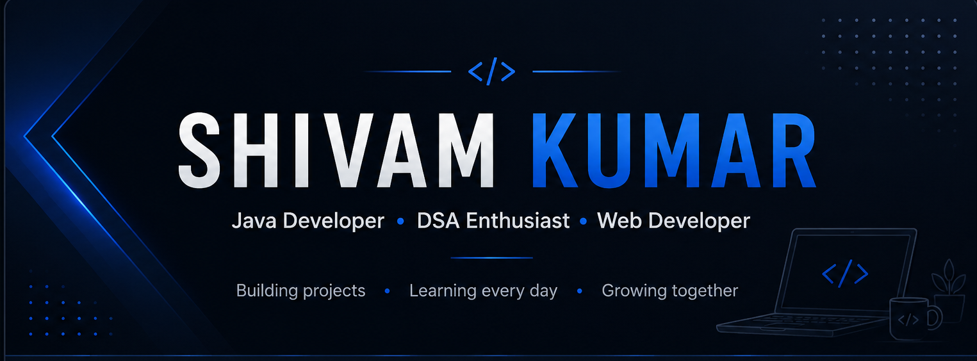

<!-- 

  

 -->
<h1 align="center">Hi 👋, I'm Shivam Kumar</h1>

<h3 align="center">
B.Tech Computer Science Student | Java Developer | DSA Enthusiast
</h3>

💻 Passionate about Java, Web Development and Data Structures & Algorithms.

🚀 Building projects every week • 📚 Solving DSA • 🌱 Learning Full Stack Development

## 👨‍💻 About Me

- 🎓 B.Tech Computer Science Student
- 💻 Interested in Software Development
- 🌱 Currently learning Java, DSA, and Web Development
- 🚀 Building projects to improve my skills
- 📫 Reach me at: **shivamkumar100406@gmail.com**
  

## 🌱 Currently Learning

- ☕ Java & Object-Oriented Programming
- 📚 Data Structures & Algorithms
- 🌐 Full Stack Web Development
- ⚡ Git & GitHub
- 🚀 Problem Solving on LeetCode

## 🛠️ Tech Stack

  
  
  
  
  
  
  
   
  
  
  
  
  
  
   
  
  
  

## 📊 GitHub Analytics

## 🚀 Featured Projects

<table>
<tr>
<td width="50%">

### 🛒 E-Commerce Website

Responsive shopping website built using HTML, CSS and JavaScript.

**Tech Stack:** HTML • CSS • JavaScript  

</td>

<td width="50%">

### ⏱️ Pomodoro Timer

A productivity timer with a clean and responsive interface.

**Tech Stack:** HTML • CSS • JavaScript  

</td>

</tr>

<tr>

<td>

### 🌦️ Weather App

Real-time weather application using OpenWeather API.

**Tech Stack:** HTML • CSS • JavaScript 

</td>

<td>

### 🤖 Line Follower Robot

Arduino-based autonomous robot using IR sensors.

**Tech Stack:** Arduino • C++ 

</td>

</tr>

</table>

## 🌐 Connect With Me

